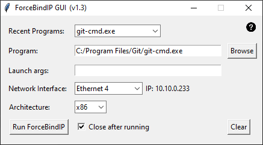

## ForceBindIP GUI

\
A simple Python GUI for running ForceBindIP

## Features

- ForceBindIP exe and dll files packaged with application, will be extracted to `%USERPRROFILE%\AppData\Local\_MEIxxxx` during runtime and cleaned up afterwards
- Drag and Drop shortcuts or exe files onto application to populate fields (will also parse any launch arguments)
- Mouse-over tooltips will display program name, filepath, or interface name (useful for values cut off in our GUI)
- Persistent configuration saves last 10 Recent Programs with launch arguments, specified interface, and architecture (saved to `%USERPROFILE\forcebindgui_config.json`)
- Switch between x86 or x64 architectures
- Correctly binds to VPN interfaces

## What is ForceBindIP?
From [https://r1ch.net/projects/forcebindip](https://r1ch.net/projects/forcebindip):

```
ForceBindIP is a freeware Windows application that will inject itself into another application and alter how certain Windows socket calls are made, allowing you to force the other application to use a specific network interface / IP address. This is useful if you are in an environment with multiple interfaces and your application has no option to bind to a specific interface.

ForceBindIP works in two stages - the loader, ForceBindIP.exe will load the target application in a suspended state. It will then inject a DLL (BindIP.dll) which loads WS2_32.DLL into memory and intercepts the bind(), connect(), sendto(), WSAConnect() and WSASendTo() functions, redirecting them to code in the DLL which verifies which interface they will be bound to and if not the one specified, (re)binds the socket. Once the function intercepts are complete, the target application is resumed. Note that some applications with anti-debugger / injection techniques may not work correctly when an injected DLL is present; for the vast majority of applications though this technique should work fine.

As of version 1.2, all known functions in WS2_32.DLL that either explicitly or implicitly bind to an interface are intercepted. Please note however that certain programs may still end up using the default interface if they implement connections that do not use the standard winsock functions. ForceBindIP will not prevent information leaks that may occur when using applications over a VPN. For example, all host name lookups (DNS requests) will be resolved through the default gateway as these requests originate from the Microsoft DNS Client, not the program.
```

## Building

```
git clone https://github.com/mistercalvin/forcebindip-gui.git
cd forcebindip-gui
pip install -r requirements.txt
pyinstaller ForceBindIP-GUI.spec
```

## Credits
- [r1ch](https://r1ch.net/projects/forcebindip) for ForceBindIP
- [saeedkhatami/FBI](https://github.com/saeedkhatami/FBI) for FBI.ico